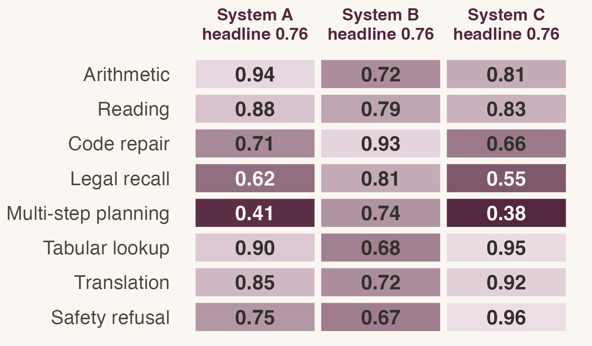

## Notation {visibility="hidden"}

\newcommand{\E}{\mathbb{E}}
\newcommand{\D}{\mathcal{D}}
\newcommand{\Sh}{\widehat{S}}
\newcommand{\se}{\operatorname{se}}
\DeclareMathOperator*{\argmax}{arg\,max}

```{r}
#| include: false
library(ggplot2)

# One figure theme for the whole deck, set once here, so a chunk only says
# what is different about its own figure. Matched to the starter theme's
# paper ground and plum accent; if you restyle the slide theme, restyle this
# with it so the figures sit on the same ground as the slides.
col_accent <- "#7d3a5e"
col_muted  <- "#6b6157"
col_flag   <- "#9c3b26"
col_bg     <- "#faf7f2"

lecture_theme <- function(base_size = 18) {
  theme_minimal(base_size = base_size) +
    theme(
      panel.grid.major  = element_line(colour = "#e5ddd0"),
      panel.grid.minor  = element_blank(),
      text              = element_text(colour = "#33302b"),
      axis.text         = element_text(colour = "#4f463c"),
      plot.background   = element_rect(fill = col_bg, colour = NA)
    )
}

theme_set(lecture_theme(18))
knitr::opts_chunk$set(dev.args = list(bg = "#faf7f2"))
```

## Where we left off {#recap}

Last week we separated the prediction from the decision it feeds, and the loss
function turned out to do most of the work.

::: {.question}
[So]{.label}
A vendor tells you their system scores 0.83 on the industry benchmark and the
incumbent scores 0.79. What have you learned?
:::

## Today {#roadmap}

<ul class="agenda">
<li class="done">Prediction is not a decision</li>
<li class="now">A benchmark score is an estimate</li>
<li>How much a leaderboard can move on its own</li>
<li>Three ways the number lies</li>
<li>What to ask a vendor instead</li>
</ul>

## A benchmark score is an estimate {.section-break}

## Two vendors, one number {#motivation}

:::: {.columns}
::: {.column width="50%"}
[Vendor A]{.yblue} scores **0.83**. It is strong on arithmetic and weak on
anything requiring several steps.
:::
::: {.column width="50%"}
[Vendor B]{.ygray} scores **0.79**. It is even across every task family, with no
sharp weakness.
:::
::::

::: {.fragment}
::: {.keyidea}
[Key idea]{.label}
The ranking is 0.04 wide. Your workload is not the benchmark, and the gap
between these two systems on *your* traffic is not 0.04.
:::
:::

## What a benchmark actually is {#definition}

Building one is its own research problem [@gao2025Scaling].

::: {.definition}
[Definition]{.label}
A *benchmark* is a fixed set of $n$ items drawn from some distribution $\D$,
scored by a rule that returns 1 for a pass and 0 for a fail.
:::

::: {.example}
[Example]{.label}
900 exam questions with published answer keys, graded by string match. $\D$ is
"questions someone thought worth writing down in 2023".
:::

## A score is an estimate {#estimator}

::: {.incremental}
- The number on the leaderboard is an average over those $n$ items.
- Averages have sampling error, so a fresh draw scores differently.
- What you actually want is the pass rate on your own traffic, which is a
  different $\D$ entirely.
:::

::: {.fragment .fade-up}
$$\Sh = \frac{1}{n}\sum_{i=1}^{n} \mathbf{1}\{\text{item } i \text{ passes}\},
\qquad \se(\Sh) = \sqrt{\frac{S(1-S)}{n}}$$
:::

::: {.aside-note}
The same arithmetic is why field measurements of AI at work report intervals rather
than a single number [@brynjolfsson2025Generative; @wiles2025Algorithmic]. The
[derivation]{.jump target="ap-se"} is in the appendix.
:::

## How much a leaderboard can move on its own {.section-break}

## The top of the leaderboard is a tie {#exhibit}

Six systems, 900 items each, with the 95% interval every score carries.

```{r}
#| label: fig-board
#| fig-width: 8
#| fig-height: 4.0
#| fig-cap: "Plum marks every system whose interval overlaps the leader's: the top four."
n <- 900
board <- data.frame(
  system = c("Aster", "Borel", "Cedar", "Delta", "Ember", "Fenwick"),
  score  = c(0.831, 0.824, 0.818, 0.792, 0.751, 0.706)
)
board$se <- sqrt(board$score * (1 - board$score) / n)
board$lo <- board$score - 1.96 * board$se
board$hi <- board$score + 1.96 * board$se
board$tied <- board$lo < max(board$hi) & board$hi > max(board$lo)
board$system <- factor(board$system, levels = rev(board$system))

ggplot(board, aes(x = score, y = system, colour = tied)) +
  geom_vline(xintercept = max(board$lo), linetype = "dashed",
             colour = col_flag, linewidth = 0.6) +
  geom_errorbarh(aes(xmin = lo, xmax = hi), height = 0.28, linewidth = 1.1) +
  geom_point(size = 4) +
  scale_colour_manual(values = c(`TRUE` = col_accent, `FALSE` = col_muted)) +
  scale_x_continuous(limits = c(0.66, 0.88), labels = scales::label_number(accuracy = 0.01)) +
  labs(x = "Benchmark score", y = NULL) +
  theme(legend.position = "none", panel.grid.major.y = element_blank())
```

## Worked example: how wide is that interval? {#worked}

::: {.steps}
1. Take the reported score as the estimate: $\Sh = 0.83$.
2. Plug in the item count: $\se = \sqrt{0.83 \times 0.17 / 900} = 0.0125$.
3. Double it for a 95% interval: $0.83 \pm 0.025$.
4. Compare to the gap you were sold: $0.04$, so the two intervals overlap.
5. Ask what $n$ would settle it. Halving the interval needs $4n$ items.
:::

## The interval you should have quoted {auto-animate="true" #ci1}

::: {style="font-size: 1.9em; color: #7d3a5e; text-align: center; margin-top: 130px;"}
$0.83 \pm 0.025$
:::

::: {style="text-align: center;"}
$n = 900$ items. The gap to the incumbent disappears inside it.
:::

## The interval you should have quoted {auto-animate="true" #ci2}

::: {style="font-size: 1.9em; color: #38684a; text-align: center; margin-top: 130px;"}
$0.83 \pm 0.006$
:::

::: {style="text-align: center;"}
$n = 15{,}000$ items. Now a 0.04 gap is real, and it cost sixteen times the
grading budget.
:::

## Overlapping intervals are the wrong test {#paired}

::: {#thm-paired}
Grade A and B on the *same* $n$ items from $\D$. Let $p_{10}$ be the chance A
passes where B fails, $p_{01}$ the reverse, and $\Delta = p_{10} - p_{01}$. Then
$$\se(\Sh_A - \Sh_B) = \sqrt{\frac{p_{10} + p_{01} - \Delta^2}{n}}.$$
:::

Items both systems pass drop out, and so do items both fail. At 0.83 against 0.79
on 900 shared items with 12% disagreement the standard error is 0.011, so the gap
runs [3.5 standard errors]{.yblue} wide.

::: {.aside-note}
A leaderboard publishes two marginal scores, so overlap is all you can draw. The
[paired standard error]{.jump target="ap-paired"} is derived in the appendix.
:::

## Your turn {#discussion}

::: {style="margin-top: 70px;"}
::: {.prompt}
You can spend the evaluation budget on 15,000 public benchmark items or on 900
items sampled from last quarter's real customer tickets. Which do you buy, and
what does the other one still get you?
:::
:::

## Three ways the number lies {.section-break}

## The three failure modes {#failures}

<table>
<thead>
<tr><th>Failure mode</th><th>What it does to $\Sh$</th>
<th class="num">Benchmark</th><th class="num">Your traffic</th></tr>
</thead>
<tbody>
<tr><td>Contamination</td><td>inflates it</td>
<td class="num">0.83</td><td class="num">0.61</td></tr>
<tr><td>Distribution gap</td><td>either direction</td>
<td class="num">0.83</td><td class="num">0.74</td></tr>
<tr><td>Goodhart drift</td><td>inflates it over time</td>
<td class="num">0.83</td><td class="num">0.79</td></tr>
</tbody>
</table>

::: {.aside-note}
Only the second one is a statistics problem. The other two are incentive
problems, and no amount of extra items fixes them. Item families make the first
column worse still; what that clustering does to the interval is
[worked out in the appendix]{.jump target="ap-clusters"}. On building the
measure before trusting it, see @golder2023Learning.
:::

## Contamination {#contamination}

:::: {.columns}
::: {.column width="60%"}
```{r}
#| fig-width: 5.6
#| fig-height: 5.2
pub <- c(0.83, 0.82, 0.82, 0.79, 0.75, 0.71)
prv <- c(0.61, 0.74, 0.78, 0.76, 0.72, 0.70)
sys <- c("Aster", "Borel", "Cedar", "Delta", "Ember", "Fenwick")

d <- data.frame(
  system = rep(sys, 2),
  set = factor(rep(c("Public", "Held back"), each = 6),
               levels = c("Public", "Held back")),
  score = c(pub, prv)
)
d$drop <- rep(pub - prv > 0.1, 2)

ggplot(d, aes(x = set, y = score, group = system, colour = drop)) +
  geom_line(linewidth = 1.1) +
  geom_point(size = 3) +
  scale_colour_manual(values = c(`TRUE` = col_flag, `FALSE` = col_muted)) +
  scale_y_continuous(limits = c(0.55, 0.88)) +
  labs(x = NULL, y = "Score") +
  lecture_theme(20) +
  theme(legend.position = "none", panel.grid.major.x = element_blank())
```
:::
::: {.column width="40%"}
::: {.warning}
[Watch out]{.label}
Rewrite the items and one system loses 0.22 while the rest hold. It memorized
the answer key.
:::
:::
::::

## What to ask a vendor instead {.section-break}

## Building your own eval set [demo]{.demo-tag} {#demo}

We will do this live in the notebook. Three lines is the whole idea.

``` r
tickets <- sample_tickets(n = 900, quarter = "2026Q2")
graded  <- grade(system_a, tickets, rubric = house_rubric)
mean(graded$pass); sd(graded$pass) / sqrt(nrow(graded))
```

::: {.aside-note}
The rubric is the hard part, not the sampling. Two graders disagreeing on 8% of
items puts a floor under how small your interval can honestly get. Where the
features being graded come from is a live question [@grewal2021Marketing;
@feng2023Marketing], and so is whether a model can propose the hypothesis as well
as test it [@ludwig2024Machine; @banker2024Machineassisted].
:::

## Check yourself {#check}

::: {.question}
[Commit, then argue]{.label}
Vendor C scores 0.96 on the public benchmark, up from 0.71 last year, on a
benchmark that has not changed. Write down one number you would ask for before
believing it.
:::

## Check yourself {#check-answer}

::: {.question}
[Commit, then argue]{.label}
Vendor C scores 0.96, up from 0.71 on an unchanged benchmark.
:::

::: {.fragment}
::: {.example}
[One good answer]{.label}
The score on a *rewritten* version of the same items. If 0.96 survives a
paraphrase, it is capability. If it falls to 0.72, the benchmark leaked into
training.
:::
:::

## What the leaderboard hides {.full-bleed #grid}



## Where we got to {#synthesis}

<ul class="agenda">
<li class="done">Prediction is not a decision</li>
<li class="done">A benchmark score is an estimate</li>
<li class="done">How much a leaderboard can move on its own</li>
<li class="done">Three ways the number lies</li>
<li class="done">What to ask a vendor instead</li>
</ul>

## What to ask a vendor {#takeaway}

::: {.keyidea}
[Key idea]{.label}
Ask for three things: the item count behind the score, the interval that count
implies, and a score on items the vendor has never seen.
:::

[Next week: where the labels come from, and who is paid to make them.]{.dim}

::: {.aside-note}
Whether anyone acts on the number is a separate problem [@dietvorst2018Overcoming],
and tailoring a system to your own traffic rather than to a benchmark is an active
line of work [@yin2024MetaLearning].
:::

## Before next class {#next-steps .closing-slide}

:::: {.together}
::: {.steps}
1. Read @golder2023Learning, pages 319--326, and bring one sentence on what they
   would want measured before a number is believed.

2. Problem set 2: redo tonight's interval at $n = 150$ and at $n = 15{,}000$, and
   say which pairs on the leaderboard stay separated at each. Due Monday, 6pm.

3. Pull 40 items off a queue your team actually answers and write the rubric you
   would grade them with. One page is enough.
:::

[Bring the rubric even if you hate it. It is what we build on next week.]{.dim}

::: {.aside-note}
Nobody writes a usable rubric on the first pass. Two graders disagreeing on 8% of
items is the ordinary starting point, and arguing about that 8% is the exercise.
:::
::::

## Appendix {.appendix-break background-color="var(--appendix-ground)"}

## Where the interval comes from {.appendix #ap-se}

<ol class="steps">
<li>One item is a Bernoulli draw: it passes with probability $S$.</li>
<li>A sum of $n$ independent draws has variance $nS(1-S)$.</li>
<li>The score divides that sum by $n$, so $\operatorname{var}(\Sh) = S(1-S)/n$.</li>
<li>Take the root, and substitute $\Sh$ for the $S$ you do not know.</li>
</ol>

::: {.aside-note}
The 1.96 is the normal approximation. It is fine at $n = 900$ and wrong at
$n = 20$, where you want the exact binomial interval.
:::

::: {.with-previous}
[Back to the lecture]{.jump-back}.
:::

## Where the paired standard error comes from {.appendix #ap-paired}

::: {.proof name="of @thm-paired"}
Write $D_i = X_i - Y_i$ for the difference of the two pass indicators on item $i$.
It is $+1$ where A passes and B fails, $-1$ where B passes and A fails, and 0
otherwise, so $\E[D_i] = p_{10} - p_{01} = \Delta$. Since $D_i^2$ is 1 exactly on a
disagreement, $\E[D_i^2] = p_{10} + p_{01}$ and
$\operatorname{var}(D_i) = p_{10} + p_{01} - \Delta^2$. The difference in scores is
the mean of $n$ independent draws of $D_i$, which divides that variance by $n$.
:::

::: {.aside-note}
Substitute the sample disagreement shares to use it. This beats the unpaired
$\sqrt{\se(\Sh_A)^2 + \se(\Sh_B)^2}$ whenever the two systems pass the same items
more often than independence predicts, which on a shared benchmark is always.
:::

::: {.with-previous}
[Back to the lecture]{.jump-back}.
:::

## When items are not independent {.appendix #ap-clusters}

Benchmark items arrive in families built from one template, so the effective
sample size is smaller than the item count.

<table>
<thead>
<tr><th>Design</th><th class="num">Items</th><th class="num">Effective $n$</th>
<th class="num">95% half-width</th></tr>
</thead>
<tbody>
<tr><td>Independent items</td><td class="num">900</td><td class="num">900</td>
<td class="num">0.025</td></tr>
<tr><td>30 templates, 30 variants each, $\rho = 0.2$</td><td class="num">900</td>
<td class="num">130</td><td class="num">0.065</td></tr>
</tbody>
</table>

::: {.aside-note}
Cluster on the template, not the item. A published score almost never does, which
is one more reason the leaderboard gap is narrower than it looks.
:::

::: {.with-previous}
[Back to the lecture]{.jump-back}.
:::

## Why more items stop helping {.appendix #ap-budget}

::: {.warning}
[Watch out]{.label}
Halving the interval costs four times the items, and grader disagreement puts a
floor under it that no item count clears.
:::

Two graders disagreeing on 8% of items hold the honest half-width near 0.02.
Past that, more items buy precision about the benchmark rather than about your
own traffic.

::: {.aside-note}
Looking inside the model instead of scoring its outputs is the other route, and it
has the same measurement problem one level down [@cunningham2023Sparse;
@templeton2024Scaling].
:::

::: {.with-previous}
[Back to the lecture]{.jump-back}.
:::

## References {.references-break background-color="var(--references-ground)"}

## References {.references}

::: {#refs}
:::
